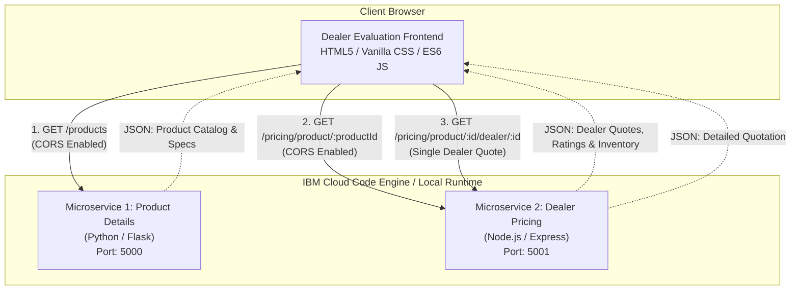

# Dealer Evaluation – Microservices Application
**Final Project Lab | JavaScript Professional Certificate Track**

[](#architecture)
[](#1-product-details-microservice-python)
[](#2-dealer-pricing-microservice-nodejs)
[](#3-dealer-evaluation-frontend)
[](#ibm-cloud-code-engine-deployment-guide)

---

## Table of Contents
1. [Project Overview](#project-overview)
2. [System Architecture](#system-architecture)
3. [Project Directory Structure](#project-directory-structure)
4. [Grading Criteria Alignment](#grading-criteria-alignment)
5. [Local Development & Execution](#local-development--execution)
6. [API Endpoints Reference](#api-endpoints-reference)
7. [Frontend Configuration (API Placeholders)](#frontend-configuration-api-placeholders)
8. [IBM Cloud Code Engine Deployment Guide](#ibm-cloud-code-engine-deployment-guide)
9. [Rubric Demonstration & Screenshot Guide](#rubric-demonstration--screenshot-guide)
10. [Version Control & Git Readiness](#version-control--git-readiness)

---

## Project Overview

The **Dealer Evaluation Microservices Application** is a decoupled, cloud-ready web solution designed to demonstrate modern microservice architecture, multi-language backend orchestration, asynchronous frontend-backend integration, and containerized cloud deployment readiness.

The application allows prospective vehicle buyers or commercial fleet managers to:
1. Select a vehicle product from a centralized catalog served by a **Python REST microservice**.
2. View detailed vehicle specifications and manufacturer MSRP.
3. Automatically load certified dealers supplying that specific vehicle from a **Node.js REST microservice**.
4. Inspect an individual dealer quote (including discount, customer rating, financing APR, inventory status, and warranty).
5. Compare **all authorized dealers** side-by-side with automatic highlight of the lowest priced offer.

---

## System Architecture



---

## Project Directory Structure

```text
dealer-evaluation-final-project/
├── product-details/                 # Microservice 1: Python Flask
│   ├── app.py                      # REST API implementation with CORS
│   ├── requirements.txt            # Python dependencies (Flask, flask-cors, gunicorn)
│   ├── Dockerfile                  # Container build recipe for Code Engine
│   └── README.md                   # Microservice documentation
│
├── dealer-pricing/                  # Microservice 2: Node.js Express
│   ├── server.js                   # REST API implementation with CORS
│   ├── package.json                # Node dependencies (express, cors)
│   ├── Dockerfile                  # Container build recipe for Code Engine
│   └── README.md                   # Microservice documentation
│
├── dealer-evaluation-frontend/      # Microservice 3: Frontend Client
│   ├── index.html                  # Responsive UI with Code Engine URL placeholders
│   ├── style.css                   # Modern dashboard design system
│   ├── script.js                   # Vanilla JS application logic & API fetchers
│   └── README.md                   # Frontend documentation & serving guide
│
├── README.md                        # Root comprehensive documentation
└── .gitignore                       # Multi-stack gitignore (Python, Node, OS, Secrets)
```

---

## Grading Criteria Alignment

| # | Grading Criterion | Implementation Location | Compliance Status |
|---|---|---|---|
| **1** | **Product Details Microservice (Python)** | [`product-details/app.py`](./product-details/app.py) | ✅ Fully implemented with Flask, CORS, Gunicorn & error handlers. |
| **2** | **Dealer Pricing Microservice (Node.js)** | [`dealer-pricing/server.js`](./dealer-pricing/server.js) | ✅ Fully implemented with Express, CORS, query/param routing & error handling. |
| **3** | **Dealer Evaluation Frontend** | [`dealer-evaluation-frontend/`](./dealer-evaluation-frontend/) | ✅ Vanilla HTML/CSS/JS with dropdowns, product card, single dealer & all dealers comparison. |
| **4** | **API Placeholders** | [`index.html#L18-L28`](./dealer-evaluation-frontend/index.html) | ✅ Explicitly declared `PRODUCT_DETAILS_API_URL` and `DEALER_PRICING_API_URL`. |
| **5** | **Exact Project Structure** | Root repository hierarchy | ✅ Exact 3-folder layout matching assignment requirements. |
| **6** | **Sample Data** | Both microservices | ✅ 5 realistic vehicle models and 5 multi-region dealerships with cross-catalog pricing. |
| **7** | **CORS Configuration** | `app.py` & `server.js` | ✅ Cross-Origin Resource Sharing enabled on both backend services. |
| **8** | **Comprehensive Documentation** | Root and microservice READMEs | ✅ Architecture diagrams, endpoint references, deployment steps, and run guides. |
| **9** | **Git / GitHub Readiness** | Root Git repository & `.gitignore` | ✅ Git initialized, clean commit history, zero secrets/credentials committed. |

---

## Local Development & Execution

To test the application end-to-end locally before deploying to IBM Cloud Code Engine:

### Step 1: Start Product Details Microservice (Python)
Open a new terminal window:
```bash
cd dealer-evaluation-final-project/product-details

# (Optional) Create virtual environment
python -m venv venv
.\venv\Scripts\activate   # On Windows
# source venv/bin/activate # On macOS/Linux

# Install dependencies
pip install -r requirements.txt

# Start the service
python app.py
```
> **Output:** Running on `http://0.0.0.0:5000/`. Health check at `http://localhost:5000/health`.

---

### Step 2: Start Dealer Pricing Microservice (Node.js)
Open a second terminal window:
```bash
cd dealer-evaluation-final-project/dealer-pricing

# Install dependencies
npm install

# Start the service
npm start
```
> **Output:** Running on `http://localhost:5001/`. Health check at `http://localhost:5001/health`.

---

### Step 3: Run Dealer Evaluation Frontend
Open a third terminal window:
```bash
cd dealer-evaluation-final-project/dealer-evaluation-frontend

# Option A: Python HTTP server
python -m http.server 8080

# Option B: Node npx serve
npx serve -l 8080
```
Open your browser and navigate to: **`http://localhost:8080`** (or open `index.html` directly in your browser).

---

## API Endpoints Reference

### 1. Product Details Microservice (Port 5000)

| Method | Endpoint | Query / Params | Description |
|---|---|---|---|
| `GET` | `/health` | None | Returns health check and total products count |
| `GET` | `/products` | `?category=<name>` (optional) | Returns full array of available products |
| `GET` | `/products/<id>` | `id`: (e.g. `P101`) | Returns details for a single vehicle model |
| `GET` | `/categories` | None | Returns list of unique vehicle categories |

#### Sample Response: `GET /products/P101`
```json
{
  "success": true,
  "data": {
    "id": "P101",
    "name": "Apex Horizon EV",
    "category": "Electric SUV",
    "msrp": 48500,
    "description": "Dual-motor all-wheel-drive electric SUV with ultra-fast charging.",
    "specs": {
      "powertrain": "Dual Electric Motors (AWD)",
      "range": "310 miles",
      "horsepower": "380 hp",
      "acceleration_0_60": "4.2 sec"
    },
    "supplier_dealer_ids": ["D101", "D102", "D103", "D105"]
  }
}
```

---

### 2. Dealer Pricing Microservice (Port 5001)

| Method | Endpoint | Parameters | Description |
|---|---|---|---|
| `GET` | `/health` | None | Returns service uptime and total records |
| `GET` | `/dealers` | None | Returns all registered dealerships |
| `GET` | `/dealers/:dealerId` | `:dealerId` (e.g. `D101`) | Returns dealership location, rating, contact |
| `GET` | `/pricing` | `?productId=P101&dealerId=D101` | Filter pricing records by product or dealer |
| `GET` | `/pricing/product/:productId` | `:productId` (e.g. `P101`) | Returns all dealer offers sorted best price first |
| `GET` | `/pricing/product/:productId/dealer/:dealerId` | Both IDs | Returns specific dealer offer for a product |

#### Sample Response: `GET /pricing/product/P101`
```json
{
  "success": true,
  "productId": "P101",
  "count": 4,
  "lowestPrice": 46200,
  "data": [
    {
      "productId": "P101",
      "dealerId": "D103",
      "offeredPrice": 46200,
      "dealerDiscount": 2300,
      "financingAPR": "2.9% (48 mos)",
      "stockStatus": "Arriving in 3 days (6 units allocated)",
      "deliveryEstimate": "4-6 business days",
      "dealer": {
        "id": "D103",
        "name": "Great Lakes Fleet & Auto",
        "location": "Detroit, MI",
        "rating": 4.6,
        "phone": "(313) 555-0199",
        "warranty": "4-Year / 50,000 mi Standard Care"
      }
    }
  ]
}
```

---

## Frontend Configuration (API Placeholders)

The frontend contains clearly marked configuration placeholders inside [`dealer-evaluation-frontend/index.html`](./dealer-evaluation-frontend/index.html#L18-L28):

```html
<!-- ===================================================================== -->
<!-- IBM CLOUD CODE ENGINE API URL PLACEHOLDERS                             -->
<!-- ===================================================================== -->
<script>
  window.PRODUCT_DETAILS_API_URL = "http://localhost:5000";
  window.DEALER_PRICING_API_URL = "http://localhost:5001";
</script>
<!-- ===================================================================== -->
```

### Switching to IBM Cloud Code Engine Production URLs
Once both backend microservices are deployed to IBM Cloud Code Engine, update lines 24–25 with the generated URLs:

```html
<script>
  window.PRODUCT_DETAILS_API_URL = "https://product-details.<region>.codeengine.appdomain.cloud";
  window.DEALER_PRICING_API_URL = "https://dealer-pricing.<region>.codeengine.appdomain.cloud";
</script>
```

---

## IBM Cloud Code Engine Deployment Guide

### 1. Prerequisites
- [IBM Cloud CLI](https://cloud.ibm.com/docs/cli) installed.
- Code Engine plugin installed:
  ```bash
  ibmcloud plugin install code-engine
  ```
- Authenticate to your IBM Cloud account:
  ```bash
  ibmcloud login --sso
  ```

### 2. Set Target Resource Group & Create/Select Project
```bash
# Target resource group
ibmcloud target -g Default

# Create or select existing Code Engine project
ibmcloud ce project create --name dealer-evaluation-project
ibmcloud ce project select --name dealer-evaluation-project
```

### 3. Deploy Product Details Microservice (Python)
```bash
cd dealer-evaluation-final-project/product-details

ibmcloud ce app create \
  --name product-details-service \
  --build-source . \
  --port 5000 \
  --min-scale 1 \
  --max-scale 3
```
> Note the public URL printed in the output (e.g. `https://product-details-service.xxxx.codeengine.appdomain.cloud`).

### 4. Deploy Dealer Pricing Microservice (Node.js)
```bash
cd ../dealer-pricing

ibmcloud ce app create \
  --name dealer-pricing-service \
  --build-source . \
  --port 5001 \
  --min-scale 1 \
  --max-scale 3
```
> Note the public URL printed in the output (e.g. `https://dealer-pricing-service.xxxx.codeengine.appdomain.cloud`).

### 5. Update Frontend & Deploy Frontend Application
1. Open `dealer-evaluation-frontend/index.html` and update `PRODUCT_DETAILS_API_URL` and `DEALER_PRICING_API_URL` with the URLs obtained from steps 3 and 4.
2. Deploy the frontend application:
```bash
cd ../dealer-evaluation-frontend

ibmcloud ce app create \
  --name dealer-evaluation-frontend \
  --build-source . \
  --port 8080 \
  --min-scale 1 \
  --max-scale 2
```

---

## Rubric Demonstration & Screenshot Guide

When taking screenshots for your lab submission:

1. **Criterion 1 (Product Details Microservice)**:
   - Run `curl http://localhost:5000/products` or visit `http://localhost:5000/products` in browser.
   - Screenshot the JSON array showing products, MSRP, and specifications.

2. **Criterion 2 (Dealer Pricing Microservice)**:
   - Visit `http://localhost:5001/pricing/product/P101` in browser.
   - Screenshot the JSON array showing multiple dealer quotes with discount and dealer details.

3. **Criterion 3 & 6 (Frontend Product Dropdown & Data)**:
   - Open frontend in browser.
   - Screenshot the Product Dropdown displaying the loaded vehicles.

4. **Criterion 3 (Product Selection & Dealer Suppliers)**:
   - Select a vehicle (e.g., *Apex Horizon EV*).
   - Screenshot showing product details card, MSRP, specs, and the populated Dealer dropdown.

5. **Criterion 3 (Single Dealer Pricing)**:
   - Select a specific dealer (e.g., *Summit Coast Motors*).
   - Screenshot showing quoted dealer price, savings vs MSRP, rating, delivery time, and warranty.

6. **Criterion 3 (All Dealers Comparison)**:
   - Select **"ALL DEALERS (Compare All Quotes)"**.
   - Screenshot showing the side-by-side comparison grid with the **"Lowest Price Offer"** badge.

7. **Criterion 4 (API Placeholders)**:
   - Screenshot lines 18-28 of `dealer-evaluation-frontend/index.html` displaying the placeholders.

8. **Criterion 5 & 9 (Project Structure & Git)**:
   - Run `tree /F` (Windows) or `find . -maxdepth 2` (Linux/Mac) in the terminal.
   - Run `git status` showing clean working tree and git commit history.

---

## Version Control & Git Readiness

The repository is initialized with a robust [`.gitignore`](./.gitignore) ensuring:
- `node_modules/` is never tracked.
- Python `__pycache__/` and virtual environments (`venv/`, `.venv/`) are excluded.
- Credentials, secret keys, `.env` files, and local IDE metadata are excluded.
